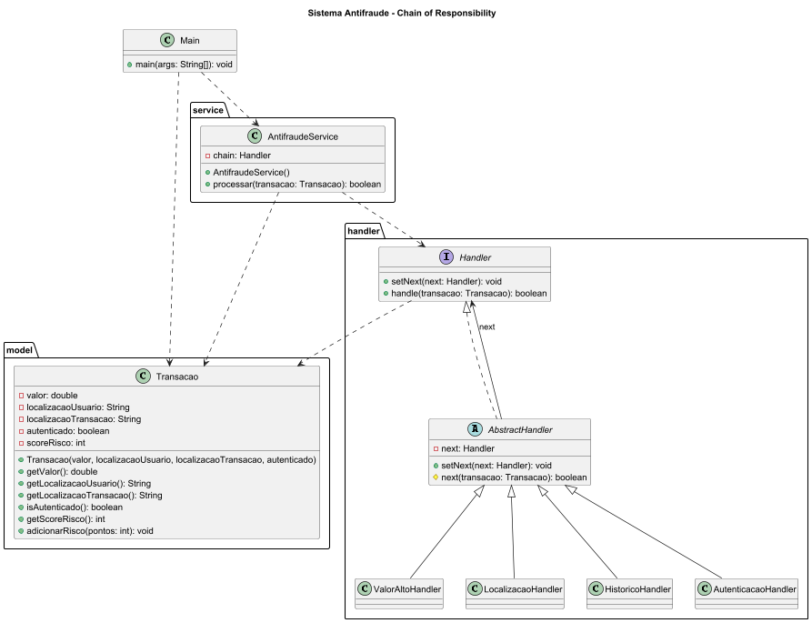

# 🛡️ Sistema Antifraude com Chain of Responsibility

Este projeto implementa um **Sistema Antifraude de Transações Financeiras** em Java, utilizando o padrão de projeto **Chain of Responsibility**.

A aplicação simula a análise de uma transação passando por uma cadeia de verificações (handlers), onde cada etapa avalia um critério de risco, como valor da transação, localização, histórico do usuário e autenticação.

Cada verificação contribui para um **score de risco**, que é utilizado ao final do processamento para decidir se a transação deve ser **aprovada ou reprovada**. Em casos críticos, como falha de autenticação, o sistema realiza o bloqueio imediato.

---

## 📊 Diagrama de Classes



---

## ⚙️ Tecnologias Utilizadas

* Java 17+
* IntelliJ IDEA
* JUnit 5 (para testes unitários)
* PlantUML (para modelagem UML)
  
---

## 📁 Estrutura do Projeto

```plaintext
src/
├── main/
│   ├── Main.java
│   ├── model/
│   │   └── Transacao.java
│   ├── handler/
│   │   ├── Handler.java
│   │   ├── AbstractHandler.java
│   │   ├── ValorAltoHandler.java
│   │   ├── LocalizacaoHandler.java
│   │   ├── HistoricoHandler.java
│   │   └── AutenticacaoHandler.java
│   └── service/
│       └── AntifraudeService.java
│
└── test/
    └── service/
        └── AntifraudeServiceTest.java
```

---

## 🚀 Como Executar o Projeto

1. Abra o projeto no IntelliJ
2. Certifique-se de que a pasta `src/main` está como **Sources Root**
3. Execute a classe:

```
Main.java
```

---

## 🧪 Como Executar os Testes

Se estiver usando Maven:

```
mvn test
```

Ou pelo IntelliJ:

* Clique com botão direito na pasta `test`
* Selecione **Run Tests**

---

## 📈 Regras de Negócio

* Cada verificação adiciona pontos ao **score de risco**
* Exemplo:

  * Valor alto → +30
  * Localização suspeita → +40
  * Histórico → +20
* Falha na autenticação → bloqueio imediato
* Regra final:

  * Score **até 50** → aprovado
  * Score **acima de 50** → reprovado

---

## 🏁 Exemplo de Saída

```
Valor alto: +30 risco
Localização suspeita: +40 risco
Histórico analisado: +20 risco
Score final: 90
Transação REPROVADA por alto risco
Resultado final: REPROVADA
```
